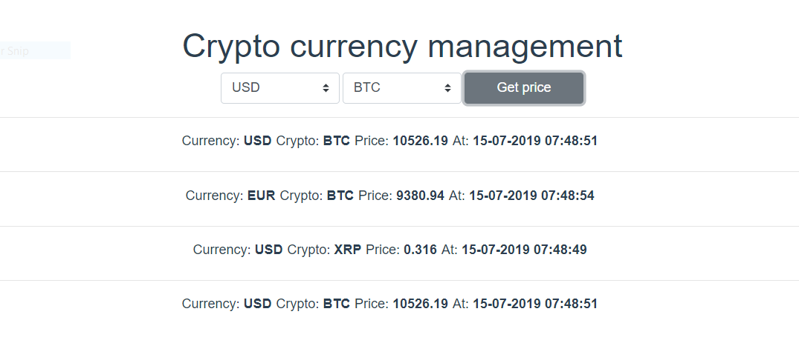

# Crypto price



This web application made with VUE as frontend SPA consumes a .NET Core API to get current crypto rates almost in real time by using websockets provided by SignalR.

The API uses a crypto provider, in this case Crypto Compare. You can get further information at:

https://min-api.cryptocompare.com

However, you can implement your preferred crypto provider as long as you implement the ICryptoProvider interface.

You must set you API key at appsettings.json file:

```
{
  "Logging": {
    "LogLevel": {
      "Default": "Warning"
    }
  },
  "AllowedHosts": "*",
  "ApiKey": "[API_KEY]"
}
```

## VUE

Install dependency packages by running:
```
npm install
```

You can run the application by running:
```
npm run serve
```